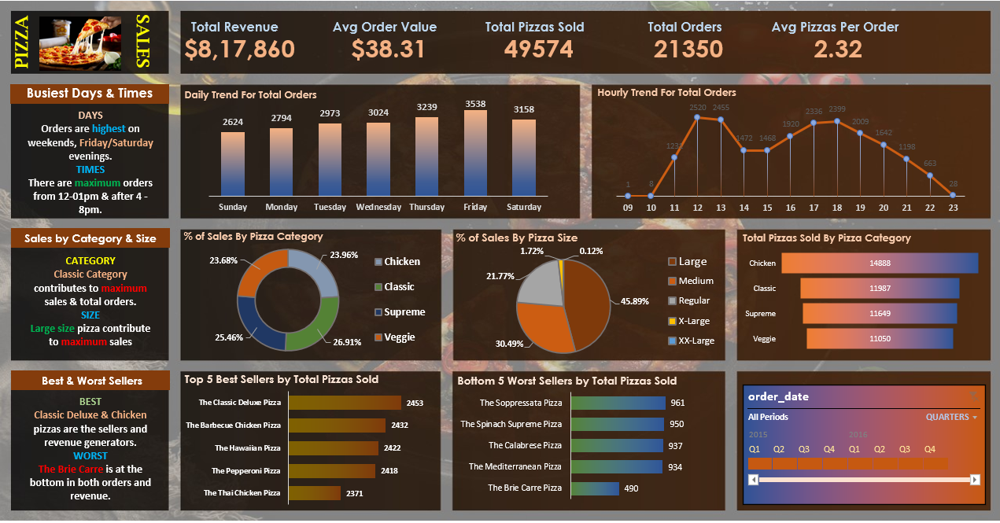

# 🍕 Pizza Sales Analysis Dashboard

This repository contains a mini project that analyzes pizza sales data using **MS Excel**. The project includes data cleaning, KPI calculation, and the creation of a visually appealing interactive dashboard to derive actionable insights.

---

## 📊 Dashboard Overview

The dashboard provides a detailed view of key performance indicators (KPIs) and visualizations that help stakeholders understand sales trends, customer preferences, and product performance.

### Key Features:
- Total Revenue Generated
- Average Order Value
- Total Orders and Pizzas Sold
- Daily and Hourly Sales Trends
- Category-wise and Size-wise Sales Distribution
- Top 5 & Bottom 5 Best-Selling Pizzas

---

## 🛠 Tools Used

- **Microsoft Excel**
  - Pivot Tables & Pivot Charts
  - Slicers for dynamic filtering
  - Data Cleaning & Formatting
  - Conditional Formatting

---

## 📁 Files Included

| File Name                      | Description                                     |
|-------------------------------|--------------------------------------------------|
| `PizzaSales Dashboard.xlsx`   | Final interactive dashboard in Excel             |
| `pizza_sales excel file.xlsx` | Raw data used for the analysis                   |
| `PIZZA SALES SQL QUERIES.docx`| SQL queries used for KPI calculation and trends  |

---

## 🧠 Insights Derived

- Peak order times identified for better staff/resource planning.
- Popular pizza categories and sizes help shape menu and marketing strategies.
- Underperforming products can be improved or removed.
- Seasonal or monthly performance can be tracked using filter options.

---

## 📝 SQL Queries (Reference)

KPI and trend-related queries were created using SQL on the raw dataset to verify and support the Excel-based dashboard. These include:
- Total Revenue
- Average Order Value
- Pizzas Sold Per Category
- Hourly & Daily Sales Trends
- Top & Bottom Pizza Sellers

You can find the detailed queries inside the `PIZZA SALES SQL QUERIES.docx` file.

---

## 📌 Conclusion

This mini project showcases how Excel can be effectively used for business intelligence and data analysis with limited resources. The dashboard is simple, yet powerful enough to help businesses make data-driven decisions.

---

## 📷 Dashboard Preview



---

## 🤝 Connect with Me

I'm currently a BTech student passionate about data analytics and dashboard design. Feel free to connect with me on [www.linkedin.com/in/saisrikar-kokku-737b65282](#) or check out my other projects!

---

⭐️ *If you found this helpful, feel free to star the repo!*

## How to View the Project

1. Clone this repository to your local machine:
   ```bash
   git clone https://github.com/Saisrikar-Kokku/Pizza-Sales-Analysis-Dashboard.git
   ```

2. Open the Power BI report file `Power BI MiniProject.pbix` in Power BI Desktop.

3. Interact with the dashboard and explore the insights.


## Future Improvements
- Incorporate additional datasets (e.g., marketing or customer feedback data) for a more comprehensive analysis.
- Enhance the dashboard with advanced visuals and machine learning-based predictions.
- Automate data refreshes for real-time insights.

## Project Contributors

- **Saisrikar Kokku**
---
Thank you for exploring this project! Feel free to fork, clone, and contribute.

-K.SAISRIKAR 
-Email: Saisrikarkokku7674@gmail.com 

